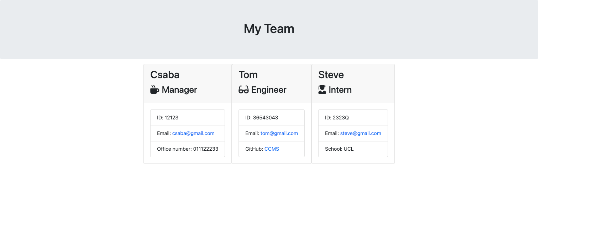

- [Description](#description)
- [Installation](#installation)
- [Usage](#usage)
- [Contributions](#contributions)
- [Tests](#tests)
- [Screenshot](#screenshot)
- [LICENSE](#license)

# Team Profile Generator

## Description
An application giving a hand to build a professional team profile and render it to an HTML document.
## Installation
Installation of Node JS and NPM packages(INQUIRER, Jest) are required. Click on [Node JS](https://nodejs.org/en/). For more information please read through the official documentations.
## Usage
Installed Node JS and NPM(INQUIRER,Jest) packages. Git cloned files. Terminal. 
## Contributions
N/A

## Tests
Test JS files written and run through Jest. 

### Screenshot

 

###### LICENSE

